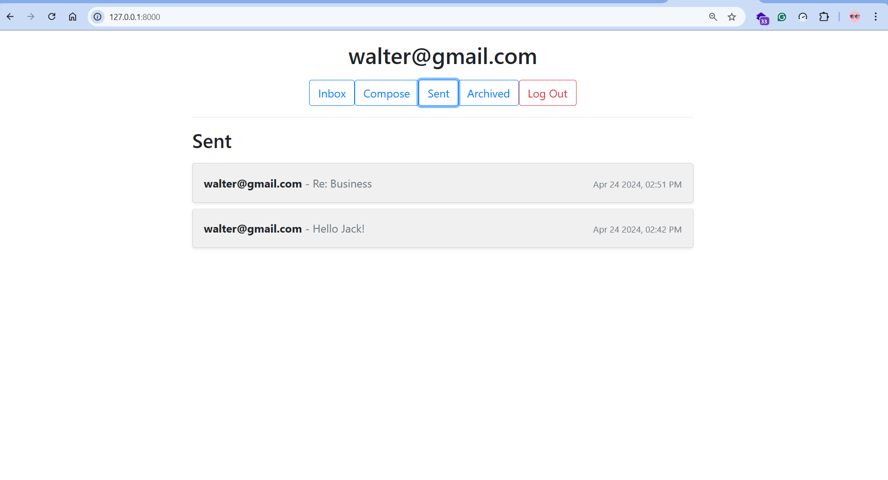

## Mail - CS50w Project 3

- A single-page email client built using JavaScript, HTML, and CSS as part of CS50W Project 3. 
- The application interacts with a Django backend through API calls, allowing users to send, receive, and manage emails within an intuitive and responsive interface. Users can compose new emails, browse different mailboxes (Inbox, Sent, Archived), read emails, reply, and archive/unarchive messages. The client dynamically updates views without requiring full-page reloads, enhancing performance and user experience.

### Screenshots

### Features

- Send Mail
    - Users can compose and send emails via a POST request to the backend.
    - After sending, the app automatically redirects users to the Sent mailbox.
- Mailbox Navigation
    - Users can switch between Inbox, Sent, and Archived mailboxes.
    - Emails are fetched dynamically using API calls.
    - Emails appear in read/unread states (gray background for read, white for unread).
- View Email
    - Clicking an email opens a detailed view with sender, recipients, subject, timestamp, and body.
    - The app automatically marks emails as read upon opening.
- Archive & Unarchive
    - Inbox emails can be archived to declutter the inbox.
    - Archived emails can be unarchived and restored to the inbox.
    - This feature is not available for sent emails.
- Reply to Emails
    - Users can reply directly from the email view.
    - The reply form is pre-filled with the recipient, subject (Re: Subject), and quoted message.
    - The app ensures a seamless email conversation experience.

### Admin Interface Credentials

-   username: saw
-   password: saw_password
